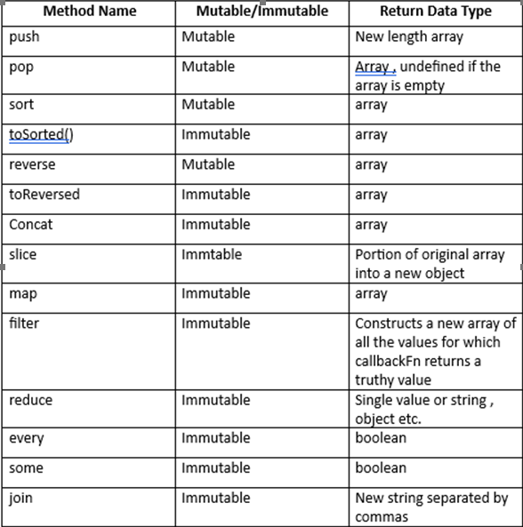

# Assignment-1

```js
// Task 1: High-Value Transactions in 2023
// Description: Given an array of transactions, identify transactions that are above $5000, occurred in 2023, and belong to the 'Business' category. Transform this filtered
// array into an array of strings formatted as "Transaction [id]: $[amount] on [date]".
// Data:
const transactions = [
  { id: "T1", category: "Personal", amount: 3000, date: "2023-01-15" },
  { id: "T2", category: "Business", amount: 6500, date: "2023-02-20" },
  { id: "T3", category: "Business", amount: 4500, date: "2023-03-05" },
  // more transactions...
];
// Expected Output:
["Transaction T2: $6500 on 2023-02-20"];
// Task 1: Departmental Salary Expenditure
console.log(
  transactions
    .filter(
      (transaction) =>
        transaction.amount > 5000 && transaction.date.startsWith("2023")
    )
    .map(
      (transaction) =>
        ` Transaction ${transaction.id}: $${transaction.amount} on ${transaction.date} `
    )
);

// Task 2: Departmental Salary Expenditure
// Description: Calculate the total salary expenditure for each department from an array of departments, each with an array of employees.
// Data:
const departments = [
  { name: "Engineering", employees: [{ salary: 80000 }, { salary: 90000 }] },
  { name: "Marketing", employees: [{ salary: 60000 }, { salary: 65000 }] },
  // more departments...
];
// Expected Output:
// [{ Engineering: 170000 }, { Marketing: 125000 }];

console.log(
  departments.map(
    (department) =>
      `${department.name} : ${department.employees.reduce(
        (acc, employee) => acc + employee.salary,
        0
      )}`
  )
);

// Task 3: Weather Data Sorting and Structuring
// Description: Sort an array of weather data objects in descending order of temperature and restructure the data into an object with dates as keys and temperatures as
// values.
// Data:
const weatherData = [
  { date: "2023-03-01", temperature: 16 },
  { date: "2023-03-02", temperature: 20 },
  { date: "2023-03-03", temperature: 18 },
  // more data...
];
// Expected Output:
// { "2023-03-02": 20, "2023-03-03": 18, "2023-03-01": 16 }
var array = weatherData
  .sort((a, b) => b.temperature - a.temperature)
  .map((wd) => `${wd.date} : ${wd.temperature}`);
const obj = { ...array };
console.log(obj);
// Task 4: Analyzing Electronics Products
// Description: From an array of products, find products in the 'Electronics' category with more than 50 reviews and a rating of at least 4.0. Calculate the average price of
// these products.
// Data:
const products = [
  { category: "Electronics", price: 199.99, reviews: 120, rating: 4.5 },
  { category: "Electronics", price: 89.99, reviews: 80, rating: 3.9 },
  { category: "Home", price: 49.99, reviews: 30, rating: 4.2 },
  // more products...
];
// Expected Output:
// 199.99 // Assuming only one product meets the criteria

console.log(
  products
    .filter((product) => product.reviews > 50 && product.rating >= 4.0)
    .map((product) => product.price)
    .reduce((acc, curr) => acc + curr)
);

// Task 5: Merging User and Order Data
// Description: Merge two arrays of objects based on a common key ( userId ) to create a new array of objects that includes each user's name and their corresponding
// order details.
// Data:
const users = [
  { userId: "U1", name: "Alice" },
  { userId: "U2", name: "Bob" },
  // more users...
];
const orders = [
  { userId: "U1", orderDetails: "Order 1 Details" },
  { userId: "U2", orderDetails: "Order 2 Details" },
  // more orders...
];

// Combine users and orders based on userId
const combinedData = users.map((user) => {
  const order = orders.find((order) => order.userId === user.userId);
  return {
    name: user.name,
    orderDetails: order.orderDetails,
  };
});

console.log(combinedData);
// Expected Output:
//[
//   { name: "Alice", orderDetails: "Order 1 Details" },
//   { name: "Bob", orderDetails: "Order 2 Details" },
// ];
```

# Array Methods with Return type and mutability:



# Advanced JavaScript Array Methods Assignment II

```js
// TASK 1: CONSOLIDATING EVENT ATTENDEES
// Description: Given arrays of attendees for different events, create a single
// array of unique attendees (no duplicates) sorted alphabetically by name.
// Data:
const event1Attendees = ["Alice", "Bob", "Charlie"];
const event2Attendees = ["Bob", "Dave", "Eve"];
const event3Attendees = ["Charlie", "Eve", "Frank"];
const TotalAttendees = [
  ...event1Attendees,
  ...event2Attendees,
  ...event3Attendees,
];
const output = [...new Set(TotalAttendees)];
console.log(output);
// Expected Output:
// ['Alice', 'Bob', 'Charlie', 'Dave', 'Eve', 'Frank']

// TASK 3: FILTERING AND MAPPING BOOK DATA
// Description: From an array of books, select books published after 2000 and
// create an array of their titles and authors in the format "Title by Author".
// Data:
const books = [
  { title: "Book A", author: "Author 1", year: 1999 },
  { title: "Book B", author: "Author 2", year: 2005 },
  { title: "Book C", author: "Author 3", year: 2001 },
  // more books...
];

console.log(
  books
    .filter((book) => book.year > 2000)
    .map((book) => `${book.title} by ${book.author}`)
);
// Expected Output:
// ['Book B by Author 2', 'Book C by Author 3']

// // TASK 4: COMPLEX PRODUCT INVENTORY ANALYSIS
// Description: Given an array of products, each with a list of stores and their
// inventory, find products that are available in all stores. A product is available
// in a store if its inventory is more than 0.
// Data:
//  // more responses...

const productss = [
  {
    name: "Product 1",
    stores: [
      { storeId: "S1", inventory: 10 },
      { storeId: "S2", inventory: 0 },
    ],
  },
  {
    name: "Product 2",
    stores: [
      { storeId: "S1", inventory: 5 },
      { storeId: "S2", inventory: 7 },
    ],
  },
];
console.log(productss.stores);
console.log(
  productss
    .filter((product) => product.stores.every((store) => store.inventory > 0))
    .map((product) => product.name)
);
// Expected Output:
// ['Product 2']
```

# Reduce Using Map

```js
// reduce using map

console.log([1, 2, 3, 4, 5].reduce((acc, curr) => acc + curr));
arr = [1, 2, 3, 4, 5];
let sum = 0;
console.log(
  arr.map((e) => {
    sum += e;
    //  sum1 = sum.slice(0, 1);
    return sum;
  })
);
```

# Concepts of Functional Programming:

## Currying:

- Currying is a technique used in functional programming languages where a function with multiple arguments is transformed into a sequence of nested functions, each taking a single argument.

```js
// Normal function
const RectArea = function (l, b, h) {
  return l * b * h;
};
RectArea(1, 2, 3); // calling Normal Function
// Curried Function
const CArea = function (l) {
  return function (b) {
    return function (h) {
      return l * b * h;
    };
  };
};
CArea(1)(2)(3); // calling curried function
```

### Benefits:

- Partial Application: Currying allows us to partially apply functions by fixing one or more arguments.

```js
// Curried functions for arithmetic operations
function curriedAdd(x) {
  return function (y) {
    return x + y;
  };
}
const add3 = curriedAdd(3);
console.log(add3(4)); // Output: 7
```

## Partial Application:

- Partial application is a technique in functional programming where we create a new function by fixing some number of arguments of an existing function. This new function, often called a partially applied function, can then be called with the remaining arguments

```js
function partialApplyLength(length) {
  return function (width) {
    return calculateArea(length, width);
  };
}

// Create a function that calculates the area of rectangles with length 3
const areaWithLength3 = partialApplyLength(3);

// Now, use the specialized function to calculate areas with width variations
const area3 = areaWithLength3(4); // area3 = 3 * 4 = 12
const area4 = areaWithLength3(6); // area4 = 3 * 6 = 18
```

## Point Free Programming:

```js
// Non-point-free style
function sum(a, b) {
  return a + b;
}

// Point-free style using function composition
const sum = (a, b) => a + b;

const addOne = (x) => x + 1;
const multiplyByTwo = (x) => x * 2;

const addOneAndMultiplyByTwo = (x) => multiplyByTwo(addOne(x));

// Point-free version using composition
const addOneAndMultiplyByTwo = compose(multiplyByTwo, addOne);

const numbers = [1, 2, 3, 4, 5, 6];

// Traditional approach
const evensTraditional = numbers.filter(function (num) {
  return num % 2 === 0;
});

// Point-free approach
const isEven = (num) => num % 2 === 0;
const evensPointFree = numbers.filter(isEven);

console.log(evensTraditional); // Outputs: [2, 4, 6]
console.log(evensPointFree); // Outputs: [2, 4, 6]
```

### Benefits:

- readability, maintainability
- Point-free programming can make code more modular and easier to understand by separating the logic into named functions
