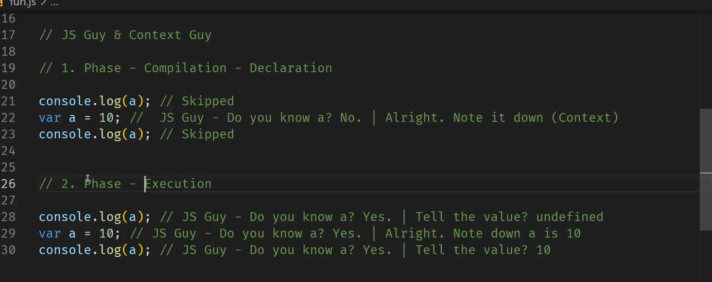

> > git push -u origin main
> > git remote add origin https://github.com/Bhanusri-1320/MeanStack.git
> > git branch -M main
> > git push -u origin main

# ParseInt:

converts a string to number
radix is optional
Syntax:
pareint('string',radix)

- the radx will specifiy the the type of string in
- by default the radix is 10 onyl
- if we give the radix <2 and >36--then it will give the output as NAN

```js
console.log(parseint("3.4")); // 3.4
console.log(parseint("3.4", 10)); // 3.4
console.log(parseint("101", 2)); // decimal value equivalent to decimal of 101
```

Matrix----movie

# not defined

- means error
- when the variable is not decalred

# undefined

- data type
- when the variable is declared and not assigned any value

# JavaScrpit is Interpretion language

# Hoisting--

> 

## if the declaration is var:

## Compilation+ Execution

- Js guy and Context guy
- execution context & js enginee

1. phase--compilation--in this phase only sees declaration--js guy

- checks the declaration

```js
console.log(b); // skipped
var b; // note down here is the declaration
```

2. pahse-2: execution phase

```sql
console.log(b); //
var b;
```

```js
console.log(b); // undefined // not declaration- skipped
var b; //declarations
```

## id declaration with let:

```js
console.log(b);
let b = 10;
console.log(b);
```
