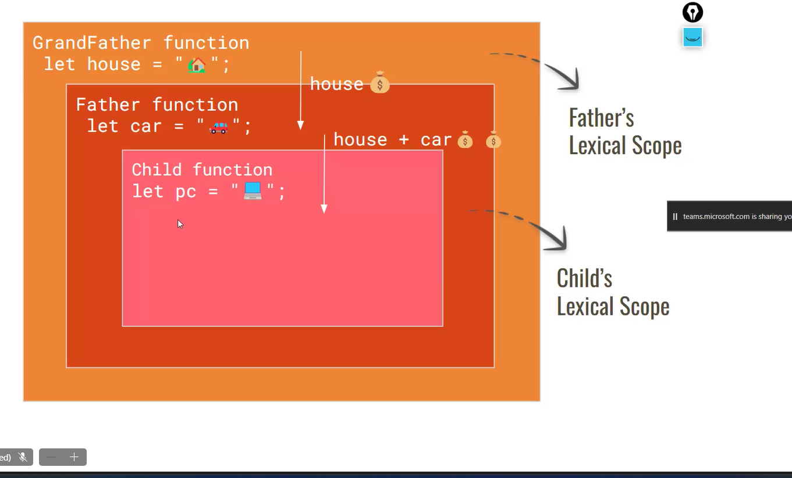
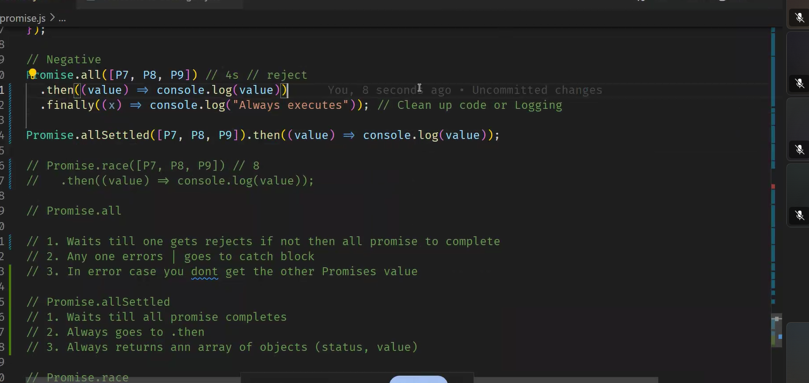

> > git push -u origin main
> > git remote add origin https://github.com/Bhanusri-1320/MeanStack.git
> > git branch -M main
> > git push -u origin main

# ParseInt:

converts a string to number
radix is optional
Syntax:
pareint('string',radix)

- the radx will specifiy the the type of string in
- by default the radix is 10 onyl
- if we give the radix <2 and >36--then it will give the output as NAN

```js
console.log(parseint("3.4")); // 3.4
console.log(parseint("3.4", 10)); // 3.4
console.log(parseint("101", 2)); // decimal value equivalent to decimal of 101
parseInt("abc"); // NAN
```

Matrix----movie

# not defined

- means error
- when the variable is not decalred

# undefined

- data type
- when the variable is declared and not assigned any value

# JavaScrpit is Interpretion language

# Hoisting--

> 

## if the declaration is var:

## Compilation + Execution

- JIT compilation happens in the java script
- Js guy and Context guy
- execution context & js enginee

1. phase--compilation--in this phase only sees declaration--js guy

- checks the declaration

```js
console.log(b); // skipped
var b; // note down here is the declaration
```

2. pahse-2: execution phase

```js
console.log(b); //
var b;
```

```js
console.log(b); // undefined // not declaration- skipped
var b; //declarations
```

## id declaration with let:

```js
console.log(b); // skipped
let b = 10; // Js -guy -- not initialized
console.log(b);
```

- initialization--- giving memeory spcae
- assigning- giving value to the memory

```js
//  JS Guy & Context guy(chithra)
//JIT --> Just in Time Compilation

// 1. Phase - compilation - Declaration
console.log(a); //skipped - not a declaration
var a = 10; //JS Guy - dyk ? no. | alright . Note it down(context)
console.log(a); //skipped

// 2 . Phase - Execution
console.log(a); //JS Guy - dyk ? yes | Tell the value ? Undefined
a = 10; //JS Guy - dyk ? yes | Tell the value ? 10
console.log(a);

// 1. Phase - compilation - Declaration
console.log(b); //skipped
let b = 10; //JS Guy - dyk ? no. | alright . Note it down b(context) Don't initialize
console.log(b); //skipped
// Intialization - creating a memory

// 2 . Phase - Execution
console.log(b); //JS Guy - dyk b ? yes. | Tell me the value - error
let b = 10;
console.log(b);

// let & const - cannot access b before initialization
```

# tdz--temporary dead zone:

- if the varibale is declsred at line 5 , then the variable in above code is dead zone, coz can't access the varibale there

```js
// herethe variable in not declared or not there inside of function so it is taking outside value
var price = 300; // lexicual scope--> if the var is not declared inside the function it is looking for the outputer var
function getprice() {
  console.log(price); //300
  console.log(price); //300
}
// since the variable is declared inside the function-- local variable has more preference
var price = 300;
function getprice1() {
  console.log(price); //undefined
  var price = 500;
  console.log(price); //500
}
```

# Shadowing:

```js
var x = 10; // Global scope --shadow

function myFunction() {
  var x = 5; // Local scope-- inner var is showding the outer variable within the function-- lime light
  console.log(x); // Outputs 5
}

myFunction();
console.log(x); // Outputs 10

function func() {
  var a = "Geeks";
  if (true) {
    var a = "GeeksforGeeks"; // New value assigned
    console.log(a);
  }
  console.log(a);
}
func();

function fun1() {
  var a = "Geeks";
  let a = "GeeksforGeeks"; // this is redeclaration
  if (true) {
    let a = "GeeksforGeeks"; // not redeclaration coz it is in another scope
    console.log(a);
  }
  console.log(a);
}
fun1();
```


# Functions-- first class citizens- like vips

## function can be treated as value then it is trated as firest class citizen

1.passing a function as argument to another function > 

```js
function sayhello() {
  return "hello";
}

console.log(typeof sayhello); // function
sayhello----function
```

> a function taking a function as argument called as higher order functions  
> 2. function returinging another function

```js
function sayhello() {
  return function () // function with no name called annonamous function
  {
    console.log("hello 😍");
  };
}
sayhello(); // returning function
var temp = sayhello(); // assigning a function to a var
sayhello()(); // calling function inside another function
```

3. 

# Lexical scope




## Clouser:


> 
> Example:
> 

# Array Methods

```js
const orages = [3, 4, 5, 6]; // address of the first value
orages.push(10);
orages[4] = 3; // will be pushed into the array
orages.push("a"); // will also get pushed
console.log(orages); // 3,4,5,6,10
// no error unit the address is not changed
orages = 10; // then error co reassigning the value means address willl change

// mrf--important--map,reduce, filter --- coz they will not mutate the array always returns a copy

orag_rev = orages.reverse(); // when we do reverse it effects the original list
console.log(orag_rev); // prints reversed one
console.log(orages); // reversed will get printed ---> called mutability ,
// so these two functions are mutable  so to avoid this we can use copy by value or using the methods wich are immutable means always returns a copy of the array
```

[1,2,3].slice(0,2)

> slice- immutable array method
> how map works  -- ❌
> actually -- reverse   -- ✔️✔️✔️

# Types of Functions:

- normal
- arrow
- annomous

# Map:

- higher order function

1. returns a copy
2. input_length=output_length
3. used for transforming data types

# Filter

> 

- higher order function

1. always returns a copy
2. input_length>=output_length
3. doesn't transform data types (input_datatype=ouput_datatype)

```sql
// Filter
console.log(avengers.filter((name) => name.length > 10));
```

# Array Functions:

## Mutable

- push
- pop
- reverse

## Immutable Array Functions:

- Map
- reduce
- filter
- sort
- slice
- concat

# Filter

# Map

# 07-08-24:

## numberic seperator

```js
let salary = 10_00_000; // _ does nothing insted of commas _ is used , only for readibility
```

## Teamp Literal


- only join will stop the chaining

## Some, ever, includes, find

some((p)=> p==='a')

# Reduce:

- converts array to any data type(array,num,obj)
- can do array to array also
- can also act like map
- create map, filter with reduce

# Optional Chaining

```js
const person1 = {
  name: {
    first: "Alice",
    last: "Johnson",
  },
  age: 28,
  favoriteColors: ["blue", "green"],
  //   place: {
  //     city: "Chennai",
  //   },
};

// defensive code
if (person1.place && person1.place.city) {
  console.log(person1.place.city);
} else {
  console.log("unknown");
}

// to slove above -- optional chaining

console.log(person1?.place?.city); // not defensive code

console.log(person1?.place?.city || "unknown"); //  checks all the falsy values , ut if we don't want to consider all those
console.log(person1?.place?.city ?? "unknown"); // nullish coaliation consoders only null/undefined

// Object short hand
// if the key name and var names are tren only the key can be shortend
// method short hand:
const obj = {
  foo: function () {
    // …
  },
  bar: function () {
    // …
  },
};
// You are now able to shorten this to:

const obj = {
  foo() {
    // …
  },
  bar() {
    // …
  },
};


// Ex1

const person = {
  name: {
    first: "Alice",
    last: "Johnson",
  },
  age: 28,
  favoriteColors: ["blue", "green"],
};

function getPersonInfo(person1) {
  const {
    name: { first: firstName, last: lastName },
    age: personAge,
    favoriteColors: [primaryColor, secondaryColor],
  } = person1;
  return `${firstName} ${lastName} is ${personAge} years old. Her favorite colors are ${primaryColor} and ${secondaryColor}.`;
}

console.log(getPersonInfo(person1));
// more
function getPersonInfo({
  name: { first: firstName, last: lastName },
  age: personAge,
  favoriteColors: [primaryColor, secondaryColor],
}) {
  return `${firstName} ${lastName} is ${personAge} years old. Her favorite colors are ${primaryColor} and ${secondaryColor}.`;
}
adding arroe function  (n) => n + 1
```

# 07-10-24


- in interpolation we can use expressions but not statements
  
  
- predicate function---always returns boolean- arrow function-in every,some
- ever is a predicate function-coz, it always takes the argument as function which returns boolean
  

  

# JSON Methods Vs JS


# Serializing---converting JS Obj into JSON (using .stringify method)

# DeSerialization-- converting back to the Object (using parse method)

# Shallow copy- js is lazy so only makes cpy of outer array not the internal array

> 

```js
var x = [1, 2, [3, 4, 5]];
var y = [...x];
```

- we don't want a shallow copy we need a deep copy to avoid the above mistake, so JSON.Parse(JSON.Stringify(x))
  >  Deep Copy
  ```js
  Object.Keys(student); // array of keys
  Object.Values(Student); // array of values
  Object.Entries(Student); // gives an array
  Object.FromEntries(Student); // reverse for entries
  ```
  [Operators](https://www.joshwcomeau.com/operator-lookup/)

# Imperative-how to do,for loops

# Declarative- What to do- map,filter

> Paradigm-types

- function
- oo
- procedural
- mathametical

# Functional Programing Concepts

1. > functional programing encourages declarative coding
   > -Assignment-1. what is currying with an example, how it can be applied in real life(array of objects)
2. Partial Application
3. Point Free Coading

# Rules for Variable Names:

1. no keywords
2. not starts with number
3. no special chars expect (\_) underscore

- camel case--abvDef
- pascial case--classes

# This :

- This will always needs context(object)
- it doen't need where it is declared , where it is called
- this doesn't make any sence without context
  eg: this is my // ho sense
- this is my book // this is pointing to nook
  
  
- this will point to the object where it is called


- window is the global object
- if there is no context it will point to window, we can make it to not ponit to window usign strict,when strict mode is on it will not point to window

# 3 Ways to force context into this:

1. call
   console.log(fullname.call(student2))

```js
const person = {
  fullName: function (city, country) {
    return this.firstName + " " + this.lastName + ", " + city + ", " + country;
  },
};
const person1 = {
  firstName: "John",
  lastName: "Doe",
};

const person2 = {
  firstName: "Jane",
  lastName: "Doe",
};

// Using call to invoke the method on different objects
console.log(person.fullName.call(person1, "New York", "USA")); // Output: "John Doe, New York, USA"
console.log(person.fullName.call(person2, "Paris", "France")); // Output: "Jane Doe, Paris, France"
```

- even if we send more arguments it will not error out , it just ignores

2. apply
   console.log(fullname.apply(student2))

- imp: call and apply were same output when there is no argument for the function the objects we are passing is not an argument

```js
const person = {
  fullName: function (city, country) {
    return this.firstName + " " + this.lastName + ", " + city + ", " + country;
  },
};

const person1 = {
  firstName: "John",
  lastName: "Doe",
};

// Using apply to invoke the method with arguments as an array
const args = ["New York", "USA"];
console.log(person.fullName.apply(person1, args)); // Output: "John Doe, New York, USA"
```

- 

3. bind
   console.log(fullname.bind(student2))
   
   

- binding this with obj-student3, tieing together the object with this

```js
const person = {
  fullName: function (city, country) {
    return this.firstName + " " + this.lastName + ", " + city + ", " + country;
  },
};

const person1 = {
  firstName: "John",
  lastName: "Doe",
};

// Using bind to create a new function with fixed arguments
const fullNameJohn = person.fullName.bind(person1, "New York", "USA");
console.log(fullNameJohn()); // Output: "John Doe, New York, USA"
```

# Arrow Function Vs Normal Fn

- Arrow function doesn't hold any context even if we try to force the context so it will refer the golbal vars i.e, window.
  
- arrow function refers to the lexical scope if arrow fun is nested inside then it will get the vars in the outer fn
- bu normal fn will not get these featur
  
- recomended nesting is normal fn inside an arrow function ✅
- normal inside normal❌
- arrow fn inside arro fn❌
- arrow fn inside normal fn❌

> ```js
> var x=5.786;
> var x=Number(5.786) // both are same
> x.toFixed()--'5.78'
> x- is a num how we can do '.' on it
> // x is number -number is wrapper class number class has these methods that's why we can apply .methids on the numbers etc called auto boxing
>  // auto boxing happens on all premitives
> ```

```

- premitives-num,string,boolean,undefined

```

> 5/0=infinity
> -5/0--infinity
> typeOf(infinity) // number

# Classes:

- try to mimic the objects of real world into class
- to make var private '#name'

```js
if (type == "WithDraw") {
  this.transactions.push({
    id: this.transactions.length + 1,
    date: new Date(),
    "type of Transaction": "WithDraw",
    amount,
  });
} else {
  this.transactions.push({
    id: this.transactions.length + 1,
    date: new Date(),
    "type of Transaction": "Deposit",
    amount: this.balance,
  });
}

this.transactions.push({
  id: this.transactions.length + 1,
  date: new Date(),
  type,
  amount,
});
```

# Inheritance:


```js

 Bank Class
class Bank {
  //making it private var
  #balance;
  static count = 0;
  static intrest = 0;
  constructor(accNo, name, balance) {
    this.accNo = accNo;
    this.name = name;
    this.#balance = balance;
    this.transactions = [];
    Bank.count += 1;
    Bank.intrest = 0;
  }
  static getCount() {
    return `No Of Bank Accounts are ${Bank.count}`;
  }
  applyIntrest() {
    this.balance *= this.#balance;
    return `Balance is ${this.#balance}`;
  }
  getTransaction() {
    return this.transactions;
  }
  transaction(type, amount) {
    this.transactions.push({
      id: this.transactions.length + 1,
      date: new Date(),
      type,
      amount,
    });
  }
  displayBalance() {
    const formateBalance1 = new Intl.NumberFormat("en-IN", {
      style: "currency",
      currency: "INR",
    }).format(this.#balance);
    return `${this.name} your balance is ${formateBalance1}`;
  }

  WithDraw(amount) {
    if (amount > this.balance) {
      return `insufficient funds😢`;
    }
    this.balance -= amount;
    this.transaction("WithDraw", amount);
    return this.displayBalance();
  }
  deposite(amount) {
    if (amount <= 0) {
      return "invalid amount";
    } else this.#balance += amount;

    this.transaction("Deposite", amount);
    return `transaction is successful, ${this.displayBalance()}`;
  }

}

```

# 17-07

# TO get interactiveness- using form elements (window elements)

# SVG VS PNG:

- in svg img is stored as formula
- even we zoom in it will not break
- that's why it is lite
  PNG,JPEG
- stores in matrix
- we zoom only one box thats why the img will break when we zoom

# Combinators:


> p+p -> adjacent sibling selector
> Pesudo Selectors:

- transition
- transform
- before after etc

https://teams.microsoft.com/l/message/19:meeting_MDQ2ODdkNGItNWFkNy00MTUxLWFjZTMtMTIwZjYzYzlhOTQ2@thread.v2/1721196362807?context=%7B%22contextType%22%3A%22chat%22%7D

> Clip path- for masking https://codepen.io/ragavkumarv/pen/OJeMJKj?editors=1100

# Position Property:

- to get over lapping
  position-static/relative/absolute
  > static -default
  > relative- good theif, no one will notice when he is moving
  > absolute- bad thef, every one will notice when moving and he goes and hides in nearest relative
  > fixed- eve if we have more text to scrool that text will scroll but this will not get scroll it is fixed (like cookies,whatsapp )

# 18-07:

# JS:

- is single thread and asyn(smart)
- concurrent
- setTimeout---is not JS code it is browser fn , it is living inside webapi

## Callback: time component involved

- An Action has to complete
- it triggers the another action
- the fn which is getting called is call back fn, in case of settimeout--the arrow fn is call back fn
- only when time component involved then it asynchronous then only it is caleed call back

# 4 parts in web:

1. (Main thread)call Stack- only place can run JS
2. WebApi: it knows to wait - which ever comes to web api are asyn, which have to wait they will come to webapi
3. callback Queue- call back fn is stored unit it is pushed to the stack
4. event Loop - will push from queue to stack only when stack is empty

## Event Loops

- all the synchronous code is called blocking code since it is blocking asnychronous code
- to avoide the blocking of code quality should be maintained -
- onclick-eventlisners---asynchrous (onclick) for click functioality

# Dooms Taiangle:

## fetch- we don't know the time

- we don't know how much time it will take to fetch but execute the part which is written that's why we use this method to get data

> To over come this dooms traingle promises are there

# Promise:

- solves call back hell

> 3 states

1. pending⌛
2. fulfilled✅
3. Rejected❌

```js
promise.resolve(3); // fullfill
promise.reject(3); // rejected
```


# REST API

- interface b/w backend and frony end
- request response , response will be a url
  

# Multiple Promises:

2 methods to handle multiple promises

- promise.all - it will wait for all the promises resolve
- if any one is rejected, all get rejected goes to catch block
- waits till one gets rejected
  >  // [2,3,4]
- promise.any / promise.race
- it will wait until any one completes
- will error out if fastest one is rejected
  >  >  > 

# Promise.allSettled()

- will give all promises with their status which got fullfilled and rejected
- this will always returns an array of object with (status and value) in array
- it waits till all promises complete
- always goes to thr .then
- in all we will not get all the promises
  

# Finally - will always get exectues

- will be used to clean up the code
  

# Async-aWait

- for asny fn we have to put await in front of that fn
- beginer friendly syntax
- in promise we hadle the error through .catch
- using try and catch

# Note:

- fetch will goes to the webApi
- coz syack doesn't know how to exectue
- and it is an asyn fn
- so fetch will also goes the round trip
- if we have .then (res=>res,json())--> .json() is also an asyn fn - so makes a round trip
- in ,then if we donesn't have any asny code then it exectutes in the stack
- if we have promises and timeout if both have same time completes at same time , then promises will be going to the vip queue in queue
